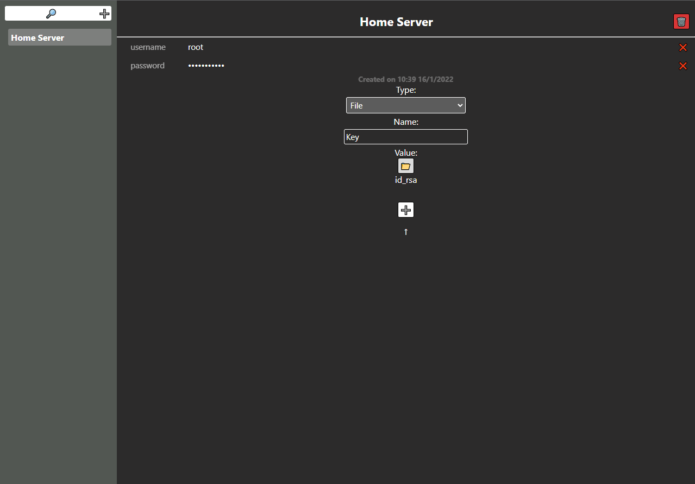

# 🌱 OpenSesame 🔒

Small web-based password manager to store your credentials and access them anywhere.

## WARNING ⚠️

This project was developed for fun in a few days, if you plan on using it you should take a look at the code as it's probably not very safe and shouldn't be trusted for super sensistive information.

## Features
- Store username/passwords/files encrypted
- Dropbox automatic backup with versions
- Client-Side encryption

## Running

You can run the development verion running the app.py file wich will start flask default development server
```
python src/app.py
```
To start the app for production it's recommended to use gunicorn or the included gevent server
```
python src/production.py
```

## Screenshots


